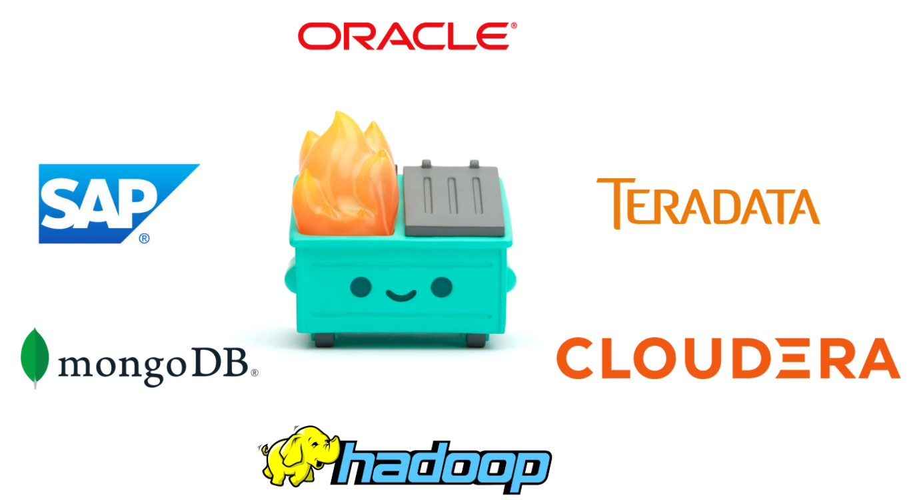
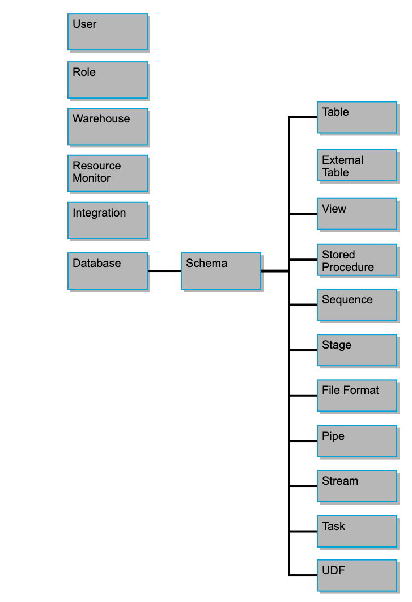
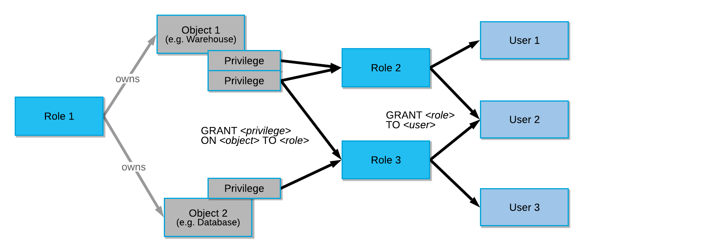
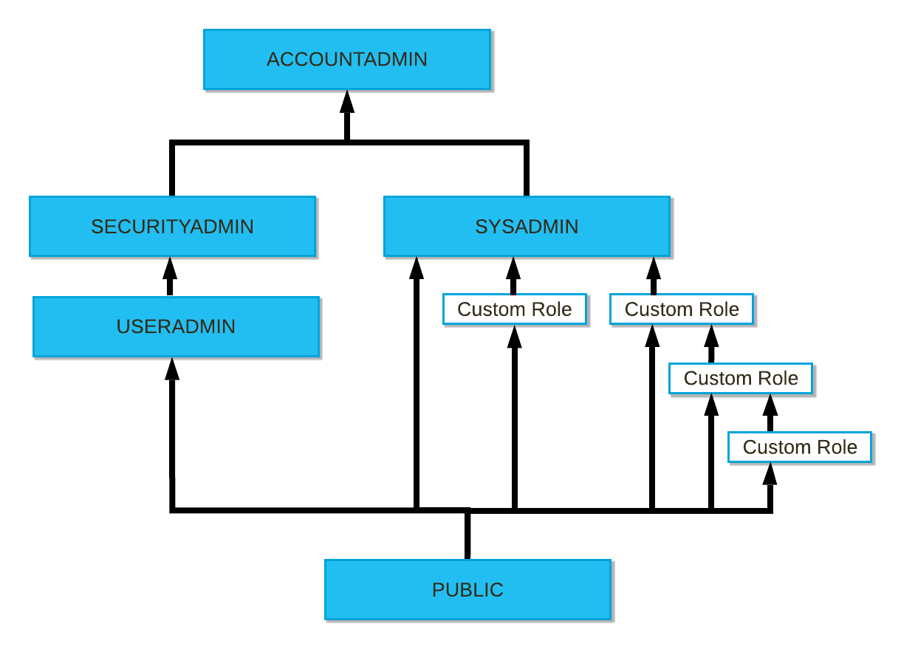
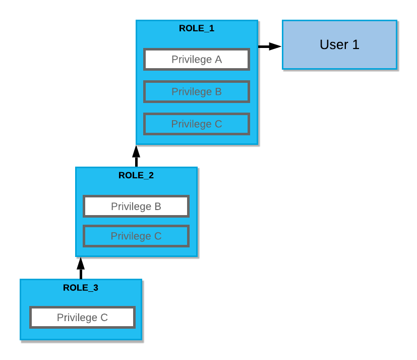

# Toboggan
Toboggan is a simple command line tool using python and json documents to simplify the data warehousing and migration process to snowflake by helping to automate:
- User creation
- Role creation and management
- Compute warehouse creation
- Database and Schema Creation
- Storage integration, external stage creation, external table creation
- Stream, Pipe, and Task Creation

##### Inputs
You can set up the snowflake infrastucture several different ways:
1) Manually through CLI entry
2) Via JSON documents
	- databases.json
	- external_tables.json
	- integrations.json
	- pipes.json
	- roles.json
	- schemas.json
	- stages.json
	- streams.json
	- tables.json
	- tasks.json
	- users.json
	- warehouses.json
3) Via import of existing snowflake infra using query tool. (Beta)

#### Context
The last 10 years of Data Architecture has been characterized by two competing visions:

- Data Warehousing: Data is stored in highly structured, highly available, but unscalable and costly relational databases using open source tools or through vendors like Oracle, Teradata, etc.
- Data Lakes: Hadoop, Apache Spark, and MongoDB were heralded as the tools that would democratize access to data across organizations at scale. Unfortunatley, the tools proved unwieldy for analysts and non data engineers to use at scale.

However, a rising third set of tools has been emerging in the past few years. This new wave of tools is built on a serverless approach to architecture giving users the value of structured, accessible, relational data, all at the cost of underlying data lake storage by leveraging the economies of scale provided by the major cloud providers.
Some of the major breakthroughs in this appoach can be seen in:
- Snowflake
- Amazon Redshift
- Google Big Query
- Azure Synapse Analytics
- Databricks Unified Analytics

###### This project focuses on Snowflake in particular as it provides a great option for a one-stop shop for cloud data warehousing. It’s cheap, powerful, has a great browser based environment, and is cloud agnostic.

##### Snowflake has a robust but complicated object and access control pattern. Toboggan is largely an effort to simplify the process of object creation and access control management tasks in Snowflake.

###### Snowflake Object Hierarchy 

###### Snowflake Access Control Relationships

###### Snowflake Role Hierarchy

###### Example Snowflake Role Hierarchy

Toboggan helps maintain the relationships of your snowflake objects and create DB design patterns that scale more easily.

Features to be included in the next iteration of this project include: 
1) Full query creation/integration
2) Vue.js front end user experience
3) Lambda/Flask Zappa backend on AWS
4) Azure setup automation

