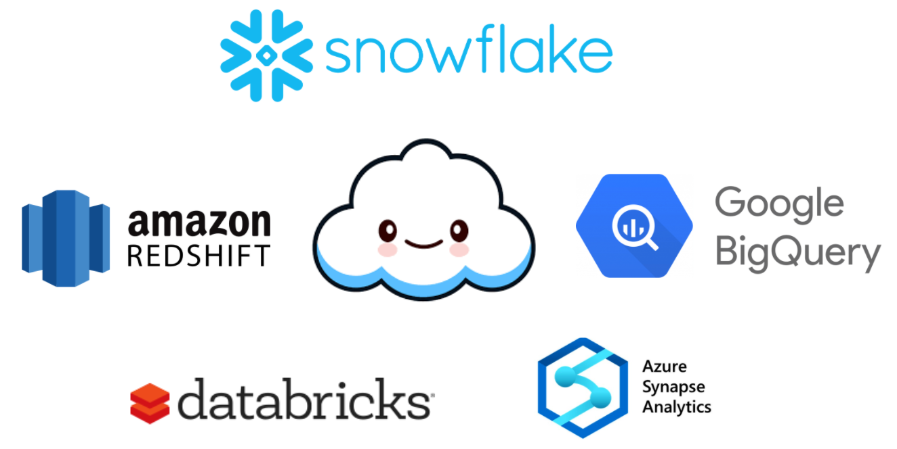
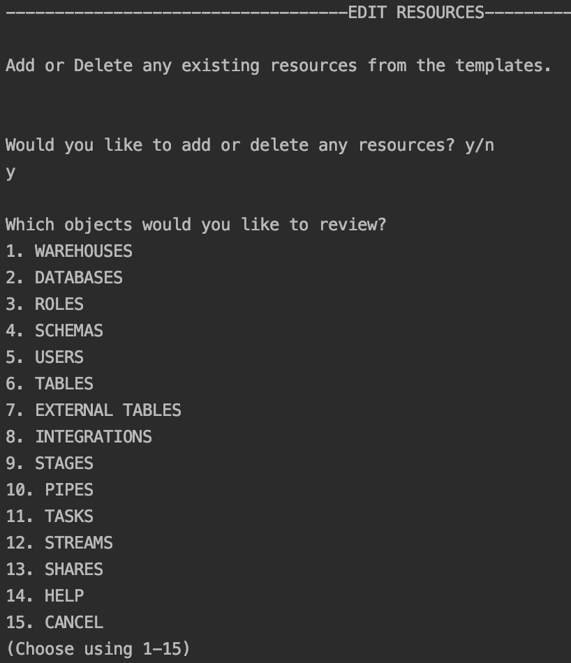

# Toboggan
This project is my capstone project from Northwestern University's Masters in Data Science program. Comments and contributors/forks welcome.

#### Toboggan is a simple command line tool using python and json documents to simplify the data warehousing and migration process to snowflake by helping to automate:
- User creation
- Role creation and management
- Compute warehouse creation
- Database and Schema Creation
- Storage integration, external stage creation, external table creation
- Stream, Pipe, and Task Creation

### Context
The data architecture space since 2005 has been characterized by two competing visions:
- Data Warehousing: Data is stored in highly structured, highly available, but unscalable and costly relational databases using open source tools or through vendors like Oracle, Teradata, etc.
- Data Lakes: Hadoop, Apache Spark, and MongoDB were heralded as the tools that would democratize access to data across organizations at scale. Unfortunatley, the tools proved unwieldy for analysts and non data engineers to use at scale.


However, a new paradigm inpsired by the principles of serverless(pay as you go) computing has been taking root in the data warehousing world. A new set of tools built on a serverless approach to architecture is giving users the value of structured, accessible, and relational data at the cost of underlying data lake storage. They are accomplishing this new cost model for consumers by decoupling storage and compute and leveraging the economies of scale provided by the major cloud providers.
Some of the major breakthroughs in this approach can be seen in:
- [Snowflake](https://www.snowflake.com/)
- [Amazon Redshift](https://aws.amazon.com/redshift/?whats-new-cards.sort-by=item.additionalFields.postDateTime&whats-new-cards.sort-order=desc)
- [Google Big Query](https://cloud.google.com/bigquery)
- [Azure Synapse Analytics](https://azure.microsoft.com/en-us/services/synapse-analytics/)
- [Databricks SQL Analytics](https://databricks.com/product/sql-analytics)


###### This project focuses on Snowflake in particular as it provides a great option for a one-stop shop for cloud data warehousing. It’s cheap, powerful, has a great browser based environment, and is cloud agnostic.

##### Snowflake has a robust but complicated object and access control pattern. Toboggan is largely an effort to simplify the process of object creation and access control management tasks in Snowflake.

###### Snowflake Object Hierarchy 


###### Snowflake Access Control Relationships


###### Snowflake Role Hierarchy


###### Example Snowflake Role Hierarchy


Toboggan helps maintain the relationships of your snowflake objects and create DB design patterns that scale more easily.

#### Future
Features to be included in the next iteration of this project include: 
1) Full query creation/integration
2) Modularization of code and unit test creation. Circle CI integration.
3) Vue.js front end user experience
4) Lambda/Flask Zappa backend on AWS
5) Azure setup automation


#### To begin:
##### Inputs
You can set up the snowflake infrastucture several different ways:
1) Manually through CLI entry
2) Via JSON documents
	- databases.json
	- external_tables.json
	- integrations.json
	- pipes.json
	- roles.json
	- schemas.json
	- stages.json
	- streams.json
	- tables.json
	- tasks.json
	- users.json
	- warehouses.json
3) Via import of existing snowflake infra using query tool. (Beta)


#### There is also an edit mode provided for adding or deleting existing resources. Be aware that deleting an object such as a database or schema also deletes all objects contained by that object.


All methods are accessible via the cli. Simply run:
```
pip install -r requirements.txt
python3 toboggan.py
```

To import a sample architecture or use a different directory for output you can change from the default output dir (toboggan/.):
```
Which mode would you like to run in?
1. CREATE
2. IMPORT
3. HELP
4. CANCEL
(Choose using 1-4)
> 2

-----------------------------------CREATE MODE-----------------------------------

What directory would you like to read from and save files to? Use relative or full path. Default is working dir. Dir should have extra directories with import files if present or else they will be created in dir.
> sample_architecture

Where would you like your sql files to read from or output to within sample_architecture? Use relative path from master dir where toboggan is running. Default dir name sql/
sql

Where would you like your sql files to read from or output to within sample_architecture? Use relative path from master dir where toboggan is running. Default dir name sql/
> 

Where would you like your json files to read from or output to within sample_architecture? Use relative path from master dir where toboggan is running. Default dir name json_files/
>

Found existing files to use for import in sample_architecture/json_files:
roles.json
external_tables.json
streams.json
pipes.json
users.json
integrations.json
tables.json
warehouses.json
stages.json
databases.json
schemas.json
tasks.json

Would you like to import from a snowflake account connection or json files?
1. Import from sql connection to existing account.
2. Import from json files in sample_architecture/json_files/
(Choose using 1-2)
2

-----------------------------------Existing Warehouses-----------------------------------

{
    "name": "TEST_WH",
    "warehouse_size": "XSMALL",
    "auto_resume": "true",
    "auto_suspend": "60",
    "comment": "test"
}
-----------------------------------Existing Database-----------------------------------

{
    "name": "TEST_DB",
    "comment": "test"
}
-----------------------------------Existing Roles-----------------------------------

{
    "name": "PUBLIC",
    "comment": "Pseudo-role that is automatically granted to every user and every role in your account. The PUBLIC role can own securable objects, just like any other role; however, the objects owned by the role are, by definition, available to every other user and role in your account.This role is typically used in cases where explicit access control is not needed and all users are viewed as equal with regard to their access rights."
}
{
    "name": "ACCOUNTADMIN",
    "comment": "Role that encapsulates the SYSADMIN and SECURITYADMIN system-defined roles. It is the top-level role in the system and should be granted only to a limited/controlled number of users in your account. This role alone is responsible for configuring parameters at the account level. Users with the ACCOUNTADMIN role can view and operate on all objects in the account, can view and manage Snowflake billing and credit data, and can stop any running SQL statements."
}
{
    "name": "SECURITYADMIN",
    "comment": "Role that can manage any object grant globally, as well as create, monitor, and manage users and roles. More specifically, this role is granted the MANAGE GRANTS security privilege to be able to modify any grant, including revoking it. Inherits the privileges of the USERADMIN role via the system role hierarchy (e.g. USERADMIN role is granted to SECURITYADMIN)."
}
{
    "name": "USERADMIN",
    "comment": "Role that is dedicated to user and role management only. More specifically, this role is granted the CREATE USER and CREATE ROLE security privileges. Can create and manage users and roles in the account (assuming that ownership of those roles or users has not been transferred to another role)."
}
{
    "name": "SYSADMIN",
    "comment": "Role that has privileges to create warehouses and databases (and other objects) in an account. If, as recommended, you create a role hierarchy that ultimately assigns all custom roles to the SYSADMIN role, this role also has the ability to grant privileges on warehouses, databases, and other objects to other roles."
}
{
    "name": "TEST_ROLE",
    "comment": "test"
}
-----------------------------------Existing Schemas-----------------------------------

{
    "name": "TEST_SCHEMA",
    "comment": "test",
    "database": "TEST_DB",
    "namespace": "TEST_DB.TEST_SCHEMA",
    "usage_access": [],
    "all_access": [
        "TEST_ROLE"
    ]
}
-----------------------------------Existing Users-----------------------------------

{
    "name": "TEST_USER",
    "warehouse": "TEST_WH",
    "namespace": "TEST_DB.TEST_SCHEMA",
    "roles": [
        "PUBLIC",
        "TEST_ROLE"
    ],
    "default_role": "TEST_ROLE"
}
-----------------------------------Existing Tables-----------------------------------

{
    "name": "TEST_TABLE",
    "namespaces": [
        "TEST_DB.TEST_SCHEMA"
    ],
    "columns": [
        {
            "column_name": "TEST_COLUMN",
            "column_type": "NUMBER"
        }
    ],
    "comment": "test"
}
-----------------------------------Existing External Tables-----------------------------------

{
    "name": "",
    "namespace": "TEST_DB.TEST_SCHEMA",
    "file_format": "PARQUET",
    "stage": "TEST_STAGE",
    "auto_refresh": "TRUE",
    "comment": ""
}
-----------------------------------Existing Integrations-----------------------------------

{
    "name": "TEST_INT",
    "cloud": "AWS",
    "integration_str": "arn:aws:iam::1234567891:role/test",
    "enabled": "TRUE",
    "storage_allowed_locations": [],
    "storage_blocked_locations": [],
    "storage_allowed_locations_str": "('*')",
    "storage_blocked_locations_str": null,
    "comment": "test"
}
-----------------------------------Existing Stages-----------------------------------

{
    "name": "TEST_STAGE",
    "integration": "TEST_INT",
    "url": "s3://bucket/dir/subdir",
    "file_format": "PARQUET",
    "namespace": "TEST_DB.TEST_SCHEMA",
    "database_name": "TEST_DB",
    "schema_name": "TEST_SCHEMA"
}
-----------------------------------Existing Pipes-----------------------------------

{
    "name": "TEST_PIPE",
    "auto_ingest": "TRUE",
    "namespace": "TEST_DB.TEST_SCHEMA",
    "full_namespace": "TEST_DB.TEST_SCHEMA.TEST_TABLE",
    "query": "SELECT *",
    "stage": "TEST_STAGE",
    "file_format": "PARQUET",
    "columns": [
        {
            "column_name": "TEST_COLUMN",
            "column_type": "NUMBER"
        }
    ],
    "column_str": "(TEST_COLUMN)"
}
-----------------------------------Existing Streams-----------------------------------

{
    "name": "TEST_STREAM",
    "full_namespace": "TEST_DB.TEST_SCHEMA.TEST_TABLE",
    "namespace": "TEST_DB.TEST_SCHEMA",
    "append_only": "FALSE"
}
-----------------------------------Existing Tasks-----------------------------------

{
    "name": "TEST_TASK",
    "warehouse_name": "TEST_WH",
    "namespace": "TEST_DB.TEST_SCHEMA",
    "full_namespace": "TEST_DB.TEST_SCHEMA.TEST_TABLE",
    "comment": "testing",
    "schedule": "5 MINUTES",
    "stream": "TEST_STREAM",
    "select_statement": "SELECT *"
}

```